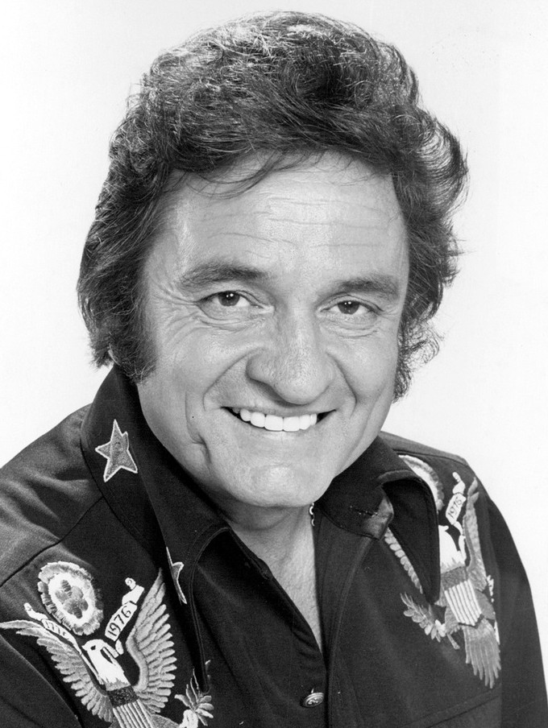

*This website is/was one of my first programming projects. In other words: when I built it, I was a noob. Predictably, then, this repo was initially a total mess. But I've leveled up since then, and I still believe in this website's mission, so I've attempted to fix things up a bit. I've had some success, but the website is still by no means perfect. Either way, I hope anyone reading this will now find that the code in this repo is at least tolerable (and hopefully get a chunkle out of the website's content, too).*

# Time to appreciate cowboys
Have you ever thought to yourself: "darn, i really wish somebody here would appreciate cowboys without things getting all weird and sexual"?

If you answered yes to that question then this website is the website for you! Welcome to cowboy appreciation! A website devoted to the nonsexual appreciation of cowboys! Yeehaw!

## Visit the website
Without further ado, here is the website (the image[^1] below is a link):

(Again, the above image is a link to the website, in case that wasn't clear)

# Casting call...
The website is currently looking for a mascot. We need someone to represent cowboy-kind in a non-sexual way. Their duties include but are not limited to:
- Posing as a cowboy while wearing a turtleneck
- Making promotional videos discussing what it means to be a cowboy (to avoid sending the wrong message, these videos will be shot in a church)
- Public outreach campaigns to help cowboys remember to stay hydrated (the Wild West is a desert and dehydration is a serious issue)
- Goodwill towards man

If you feel up for the challange, and you are capable of meeting the above requirments, please submit your auditon in the 'casting' page of the website.

# Credits
The footage on the landing page is taken from _[Cattle Stampede](https://archive.org/details/cattle-stampede-1943-colorized)_ 1943 (colorized) and _[Man of the Frontier](https://archive.org/details/ManOfTheFrontier19361080p)_ (1936).

The images displayed on the "don't make things weird" page are, in order:

- An image of an unknown cowboy from _Library of Congress_, Public domain, via [Wikimedia Commons](https://commons.wikimedia.org/wiki/File:A_cowboy-LCCN2008678055.jpg)
- A picture of Johnny Cash from _CBS Television_, Public Domain, via [Wikimedia Commons](https://commons.wikimedia.org/wiki/File:Johnny_Cash_1977.jpg)
- A picture of _John C. H. Grabill_, Public Domain, via [Wikimedia Commons](https://commons.wikimedia.org/wiki/File:Grabill_-_The_Cow_Boy-edit.jpg)
- A picture of cowboys from _SMU Central University Libraries_, Public domain, via [Wikimedia Commons](https://upload.wikimedia.org/wikipedia/commons/f/f7/Cowboys_on_horseback_with_cattle_%2812178895856%29.jpg)
- A picture of _George Fletcher_, Public domain, via [Wikimedia Commons](https://commons.wikimedia.org/wiki/File:George_Pendleton_Pendleton_Round_Up_Rodeo.jpg)

The form for the casting call was made using Google sheets.

[^1]: Johnny Cash, from CBS Television, Public Domain, via [Wikimedia Commons](https://commons.wikimedia.org/wiki/File:Johnny_Cash_1977.jpg)
